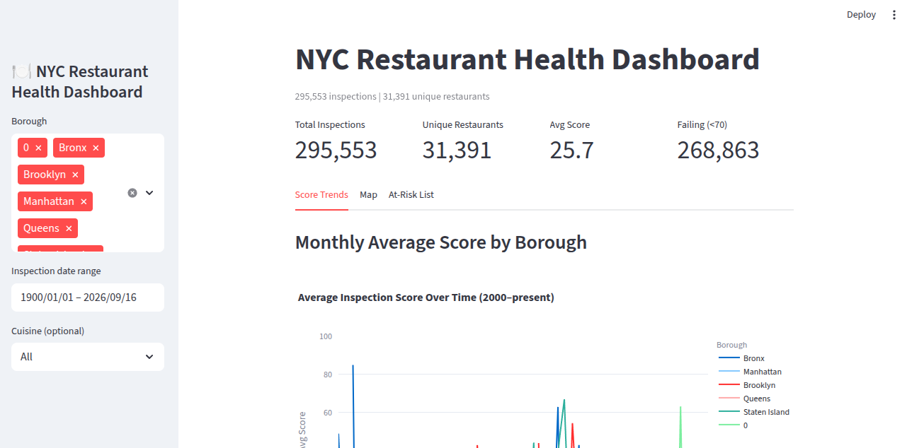
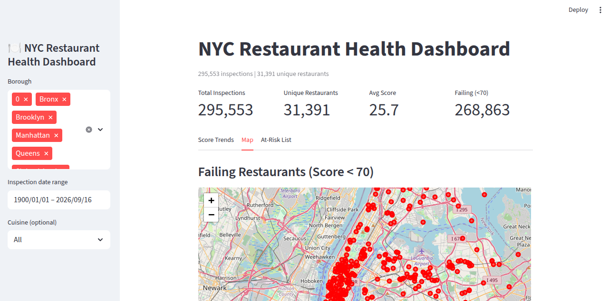
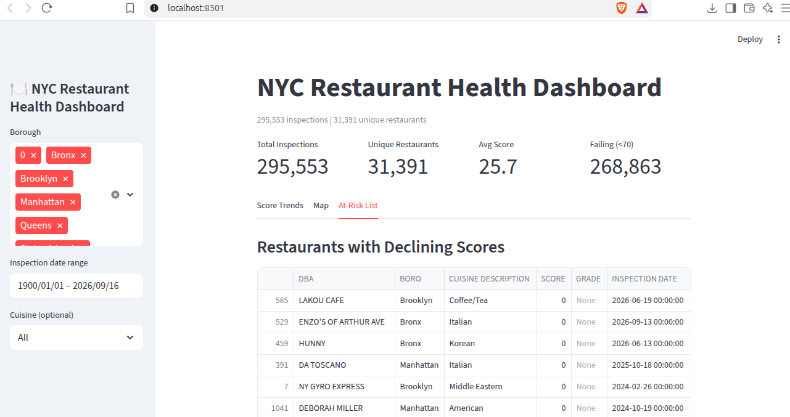

# NYC Restaurant Health Dashboard

**Problem:** NYC conducts ~300K restaurant inspections per year. This interactive dashboard lets you explore inspection scores, identify failing restaurants by location, and flag restaurants with declining scores.

**Stack:** Streamlit, Pandas, Plotly, Folium

## Live Demo

> [https://restaurant-health-5fkdrlabreerjmpzyegtsp.streamlit.app](https://restaurant-health-5fkdrlabreerjmpzyegtsp.streamlit.app)

> Upload the [NYC Restaurant Inspection CSV](https://data.cityofnewyork.us/Health/DOHMH-New-York-City-Restaurant-Inspection-Results/43nn-pn8j) to get started.


## Screenshots

| Dashboard | Map | At-Risk List |
|-----------|-----|--------------|
|  |  |  |

## How to Run

```bash
pip install -r requirements.txt
streamlit run src/app.py   


Place inspections.csv in data/ (see Data section).

Features
- Score Trends: Monthly average score by borough (2000–present), score distribution histogram
- Map: Failing restaurants (score < 70) plotted with Folium
- At-Risk List: Restaurants whose last 3 inspection scores are declining, with CSV export
  Filters: Borough, date range, cuisine type
  

Data
DOHMH New York City Restaurant Inspection Results (~295K rows).

Download the CSV and place it in data/inspections.csv.

restaurant-health/
├── README.md
├── requirements.txt
├── .gitignore
├── dashboard.png
├── map.png
├── at_risk.png
├── data/
│   └── inspections.csv   ← (gitignored)
└── src/
    └── app.py   
    
    
Limitations
Map shows a random sample of 500 failing restaurants (performance constraint).
"Declining score" is defined as: last score < first score across the most recent 3 inspections.
No handling for restaurants that were closed/reopened (same CAMIS, different era).


